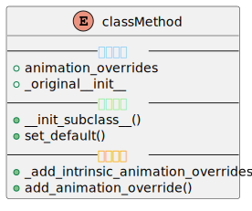
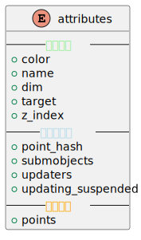
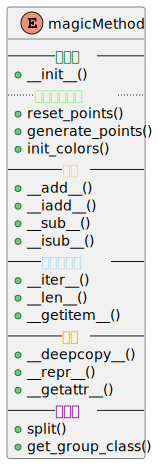
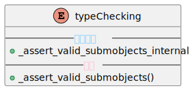
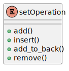
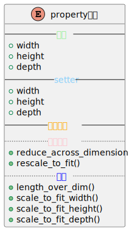
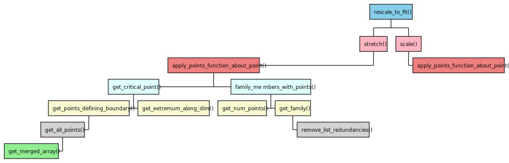

# 简单叙述
&emsp;&emsp;先从mobject开始, 因为类之间的耦合性不强,单独分析十分合适.而且我研究了很久的VMobject,所以从这里入手也比较合适.

**注意** 
- 明确目的是什么
- 高度抽象化,不涉及如何渲染得出图像内容
- 关键信息存放在列表中,而这些信息或许也只是抽象的点坐标
- 不明白的属性/方法放到专门的文件中,方便后续查找
- 一定会有函数嵌套函数的情况,可能都在该类中,可能在其他文件中,我们只需要明确,当前函数起到什么作用即可,具体描述放到文档中,但是最好标注出内部函数出处.

# 目录
- [00类方法](#00类方法)
    - [涉及属性](#涉及属性)
    - [主要方法](#主要方法)
    - [内部函数](#内部函数)
- [01基本属性](#01基本属性)
    - [传入属性](#传入属性)
    - [初始化属性](#初始化属性)
- [02魔法方法](#02魔法方法)
    - [初始化](#初始化)
    - [占位](#占位)
    - [其他](#其他)
    - [子函数](#子函数)
    - [含有子函数](#含有子函数)
- [03类型检查](#03类型检查)
    - [底层实现](#底层实现)
    - [接口](#接口)
- [04集合操作](#04集合操作)
- [05property属性](#05property属性)
    - [基本](#基本)
    - [setter](#setter)
    - [涉及方法](#涉及方法)
        - [底层实现](#底层实现)
        - [接口](#接口)

## 00类方法

    

### 涉及属性
- `animation_overrides`为主要存储属性,用于存放所有被`override_animation`装饰了的动画类型
- `_original__init__`存放父类的`__init__()`方法,方便后续调用.不过什么时候用呢?[这儿第三点](#主要方法)
### 主要方法
- `__init__subclass__()`继承时被自动调用
- 目的单纯,主要与`override_animation`装饰器相关,动作统一
- `set_default()`这解释了上面的[`_original__init__`](#涉及属性)存在的意义.没有`**kwargs`,默认初始化就是一般样式,直接赋为`_original__init__`.有`**kwargs`,则调用`partialmethod()`方法(python自带),来将默认值设为传入的`**kwargs`.
### 内部函数
- 将使用`override_animation`装饰器的方法,存储到`animation_overrides`属性字典中

> 何时使用animation_overrides呢?
> 每当继承时,都会自动调用`__init__subclass__()`及其内部函数

## 01基本属性

    

### 传入属性
- `color` 类型为`ParsableManimColor` | `list[ParsableManimColor]`,相较于`ManimColor`更宽泛,但在初始化当中,仍被修改为`ManimColor`类型
- `name` 默认为`__class__.__name__`
- `dim` 维度,极具抽象化.但是如何应用呢?拭目以待.
- `target`默认为None,此时不知道何用
- `z_index`跟二维层级有关.
### 初始化属性
- `point_hash` None
- `submobjects` 子对象,不多说了
- `updaters` []
- `updating_suspended` False
> 这部分内容有些我确实不太清楚,后续再转接回来
## 02魔法方法

    

### 初始化
- `__init__()` 传入`color`被归整为`ManimColor`类型,并且重置点,生成点,初始化颜色.
- `reset_points()` 将`points`属性设为`np.zero`,shape为属性`dim`
- `generate_points()` 为抽象方法,后续继承类差不多都要使用这个方法(用户层面来看不用,不是绝对的抽象方法)
- `init_colors()` 也是一个空方法,子类可以继承
### 占位
- 这些都是空方法,为后续`VGroup()`占位.
### 其他
- `__deepcopy__()` 这里重写了`__deepcopy__()`,用户调用`copy.deepcopy()`方法时,会用到这里重写的深度拷贝方法.实现细节另出文档.
- `__repr__()` 用户`print`该类时会调用(不过目前我还没明白`__repr__()`与`__str__()`的调用顺序.在`scene`中输出`self.mobjects`调用的是`str`,而`mobject`中调用的是`repr`,不明白...后续再研究吧)
- `__getattr__()` 这是`manim`的一个动态设计模式,目前还没有搞清楚,因为这个方法平时也确实用不到,后续研究研究.
### 子函数
- `split()` 这个方法的作用是查看本身是否有`points`,有`points`说明有子对象,需要`split`,将`self`与`self.submobjects`合并起来.没有则返回本身列表对象.
- `get_group_class()` 这个是为`__getitem__`准备的.`Mobject`获取的是`Group`,那么我猜`VMobject`重写了这个方法,获取的是`VGroup`
### 含有子函数
`__iter__()` 使对象具有可迭代性,(激活`in`关键字).
`__len__()` 这个不多说了.
`__getitem__()` 可以下标访问.另外似乎也能传入切片对象.
> 题外话: 目前为止,`manim`写过的这些方法,我们也可以自己尝试写写,因为确实也不困难.
## 03类型检查

    

### 底层实现
`_assert_valid_submobjects_internal()` 具体实现细节就不说了,放入文档中吧.
### 接口
`_assert_valid_submobjects()` 这个一看就明白了,因为我自己写也是这样,复杂逻辑放到一个函数中,然后再专门写个接口,方便后续调用的时候再用.这里也是一样的,不过子类继承后可以重写这个方法.
## 04集合操作

    

- `add()` 底层保证了十分强大的安全性.除了用`_assert_valid_submobjects()`之外,对元素重复性添加,也进行了相关的安全判断分析.主要用到了两个函数[remove_list_redundancies()](https://github.com/ManimCommunity/manim/blob/main/manim/utils/iterables.py#L257)(去重,保持顺序,并逆序), [list_update](https://github.com/ManimCommunity/manim/blob/main/manim/utils/iterables.py#L149).
> 从这里也能很明显地看出,自己写与包装成库的不同.自己十分清楚怎么传参合理,但是如果给别人用,如何最大程度的包容不同人可能存在的错误.
- `insert()` 调用列表的`insert()`
- `add_to_back()` 这个不怎么用,实现细节也就不多说了.
- `remove()` 这个也不多说了.
## 05property属性

    
    

### 基本
### setter
### 涉及方法
#### 底层实现
#### 接口

